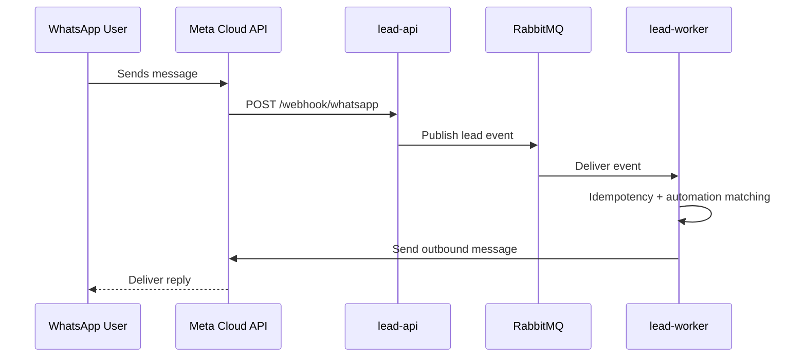

# Leadz 🚀

> Multi-tenant WhatsApp lead automation platform built with Spring Boot microservices.


## ✨ What This Project Does

Leadz receives inbound WhatsApp messages through Meta Cloud API webhooks, publishes events to RabbitMQ, processes them asynchronously, applies automation rules, and sends replies via WhatsApp Cloud API.

## 🧩 Architecture

```text
WhatsApp
   ↓
Meta Cloud API
   ↓
Webhook
   ↓
API
   ↓
RabbitMQ
   ↓
Worker
   ↓
Automation Engine
   ↓
WhatsAppSender
```

### Sequence (Ingestion to Reply)



## 📦 Modules

- `lead-api`: REST API, auth, tenant isolation, rate limiting, webhook ingestion, Flyway ownership.
- `lead-worker`: Async lead processing, automation execution, outbound WhatsApp sender.
- `lead-domain`: Shared entities/repositories.
- `lead-contracts`: Shared DTOs/enums.

## 🛠️ Tech Stack

- Java 21
- Spring Boot 3.5
- PostgreSQL 16
- RabbitMQ 3.13
- Redis 7
- Flyway
- Docker Compose

## ✅ Prerequisites

- Docker + Docker Compose
- `make`

## ⚙️ Quick Start

1. Copy env template:
```bash
cp .env.example .env
```
2. Fill `.env` with real values:
- `JWT_SECRET`
- `WHATSAPP_VERIFY_TOKEN`
- `WHATSAPP_APP_SECRET`
- `WHATSAPP_TOKEN`
- `WHATSAPP_PHONE_ID`
3. Start services:
```bash
make up
```
4. Check status:
```bash
make ps
```

API base URL: `http://localhost:8080`

## 📚 Swagger / OpenAPI

- Swagger UI: `http://localhost:8080/swagger-ui/index.html`
- OpenAPI JSON: `http://localhost:8080/v3/api-docs`

For protected endpoints in Swagger UI:
1. Call `POST /auth/login` and copy the returned token.
2. Click `Authorize`.
3. Paste `Bearer <token>`.

## 🔐 Auth Model

- Public endpoints: `POST /auth/login`, `POST /tenants`, `GET /webhook/whatsapp`, `POST /webhook/whatsapp`
- `X-Hub-Signature-256` required for `POST /webhook/whatsapp` (HMAC SHA-256 using `WHATSAPP_APP_SECRET`)
- `Authorization: Bearer <jwt>` required: `/tenants/**` (except create), `/leads/**`, `/automation-rules/**`

Tenant isolation is enforced using tenant context + tenant-scoped repository queries.

## 🌐 API Endpoints

| Method | Path | Auth | Purpose |
|---|---|---|---|
| `POST` | `/auth/login` | Public | Admin login (JWT) |
| `POST` | `/tenants` | Public | Create tenant + initial admin |
| `GET` | `/tenants` | Bearer JWT | Current tenant info |
| `GET` | `/tenants/{id}` | Bearer JWT | Get tenant by id (ownership enforced) |
| `PATCH` | `/tenants/{id}/deactivate` | Bearer JWT | Deactivate tenant |
| `POST` | `/tenants/{id}/regenerate-api-key` | Bearer JWT | Rotate tenant API key |
| `GET` | `/webhook/whatsapp` | Public | Meta webhook verification |
| `POST` | `/webhook/whatsapp` | Public + Signature | Receive incoming lead event |
| `GET` | `/leads` | Bearer JWT | List tenant leads |
| `GET` | `/leads/{id}` | Bearer JWT | Get tenant lead by id |
| `GET` | `/leads/{leadId}/timeline` | Bearer JWT | Lead timeline |
| `POST` | `/automation-rules` | Bearer JWT | Create rule |
| `GET` | `/automation-rules` | Bearer JWT | List rules |
| `PUT` | `/automation-rules/{id}` | Bearer JWT | Update rule |
| `DELETE` | `/automation-rules/{id}` | Bearer JWT | Delete rule |

## 🧪 Example Requests

### 1) Create Tenant

```bash
curl -X POST http://localhost:8080/tenants \\
  -H "Content-Type: application/json" \\
  -d '{
    "name": "Acme",
    "plan": "PRO",
    "requestsPerMinute": 120,
    "whatsappPhoneNumberId": "123456123",
    "adminEmail": "admin@acme.com",
    "adminPassword": "StrongPass123!"
  }'
```

### 2) Login

```bash
curl -X POST http://localhost:8080/auth/login \\
  -H "Content-Type: application/json" \\
  -d '{
    "email": "admin@acme.com",
    "password": "StrongPass123!"
  }'
```

### 3) Verify Meta Webhook

```bash
curl "http://localhost:8080/webhook/whatsapp?hub.mode=subscribe&hub.verify_token=<VERIFY_TOKEN>&hub.challenge=12345"
```

### 4) Send Inbound Event (Webhook POST)

```bash
curl -X POST http://localhost:8080/webhook/whatsapp \\
  -H "Content-Type: application/json" \\
  -H "X-Hub-Signature-256: sha256=<HMAC_SHA256_OF_RAW_BODY_USING_WHATSAPP_APP_SECRET>" \\
  -d '{
    "field": "messages",
    "value": {
      "messaging_product": "whatsapp",
      "metadata": {
        "display_phone_number": "16505551111",
        "phone_number_id": "123456123"
      },
      "contacts": [
        {
          "profile": {
            "name": "test user name",
            "username": "@testusername"
          },
          "wa_id": "16315551181"
        }
      ],
      "messages": [
        {
          "from": "16315551181",
          "id": "ABGGFlA5Fpa",
          "timestamp": "1504902988",
          "type": "text",
          "text": {
            "body": "this is a text message"
          }
        }
      ]
    }
  }'
```

## 🗄️ Data & Migrations

- Flyway migrations are owned by API at `lead-api/src/main/resources/db/migration`
- JPA schema mode is `ddl-auto: validate`

## 🧰 Developer Commands

```bash
make up                 # Build and run stack
make down               # Stop stack
make clear              # Stop and remove orphans
make reset-db           # Remove DB volume
make logs SERVICE=lead-api
make logs SERVICE=lead-worker
make ps
```

### Tests

```bash
make test
make test-unit
make test-integration
```

Manual Maven (example):

```bash
docker run --rm -v "$PWD:/app" -w /app -v "$HOME/.m2:/root/.m2" maven:3.9.9-eclipse-temurin-21 \\
  mvn -pl lead-api -am test
```

## 🧯 Troubleshooting

- First build can take a long time because Docker/Maven downloads dependencies.
- If startup fails after schema/model changes:
```bash
make reset-db
make up
```
- If Java intellisense gets weird in VS Code: reload window + Java project reload.
